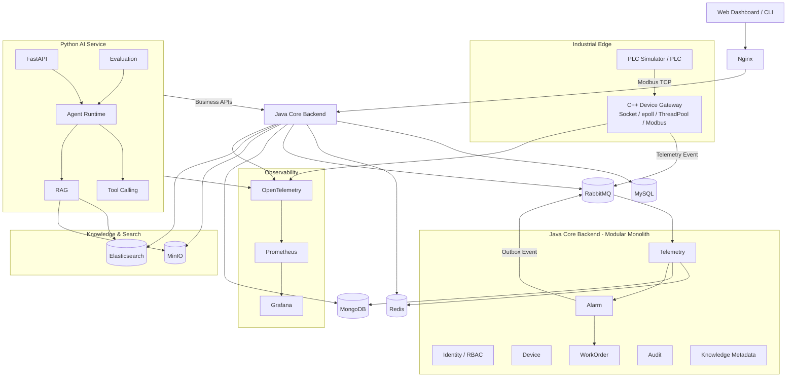

# SmartFactory AI Ops Platform

> Enterprise-grade industrial intelligent operations platform for learning and practicing **C++ Systems + Backend Engineering + AI Engineering** through one coherent, production-oriented project.

---

## 项目定位

SmartFactory AI Ops Platform 不是一个“为了展示框架而堆技术栈”的 Demo，也不是一个 ChatGPT 套壳项目。

本项目围绕一个真实工业运维闭环，逐步构建一个可测试、可观测、可演进、可压测、可故障恢复的企业级系统：

```text
工业设备 / PLC
    ↓
设备接入与数据采集
    ↓
实时数据管道
    ↓
设备状态 / 历史数据
    ↓
报警检测
    ↓
可靠事件处理
    ↓
工单与运维闭环
    ↓
知识库 / RAG
    ↓
AI 诊断 / Tool Calling / Agent
    ↓
人工审批 / 审计
```

项目同时承担三类目标：

1. **真实业务目标**：实现设备接入、遥测、告警、工单、知识库和 AI 辅助运维的完整闭环。
2. **工程能力目标**：训练网络、并发、数据库、缓存、消息可靠性、测试、可观测性、性能和系统设计能力。
3. **学习与求职目标**：通过真实代码、测试、Benchmark、故障案例、ADR 和评测结果，形成可在面试中深入讲解的项目证据。

---

## 核心原则

### 1. 深度优先于技术数量

每引入一个组件，都必须能回答：

- 它解决什么业务或工程问题？
- 为什么现有组件不能很好地解决？
- 它带来了什么新的复杂度？
- 如何测试它确实发挥作用？
- 如果删除它，系统会失去什么能力？

### 2. 生产主链与学习实验分离

项目原规划中的技术会保留学习，但不会为了“技术栈丰富”全部强塞进生产主链。

- **Production Path**：当前阶段确实需要、承担明确职责的组件。
- **Evolution / Lab**：为了学习、比较或未来演进而实现的独立实验。
- 所有重大选择通过 `docs/adr/` 记录 Architecture Decision Record。

### 3. 项目完成不等于“代码能跑”

一个功能达到 Done，至少应考虑：

```text
Correctness
+ Test
+ Error Handling
+ Logging
+ Metrics
+ Documentation
+ Recovery
+ Security
+ Performance Evidence
```

### 4. AI 不能绕过业务系统和安全边界

AI 只能通过明确的 Tool/API 访问业务能力。

有副作用的操作必须经过：

```text
Agent Proposal
    ↓
Schema Validation
    ↓
Policy / RBAC
    ↓
Human Approval（高风险）
    ↓
Backend Command
    ↓
Audit Log
```

LLM 不直接写数据库，也不直接向 PLC 写寄存器。

---

# 当前状态

当前仓库处于 **v0.1：Backend Foundation** 阶段。

## 已完成

- [x] Spring Boot 项目基础
- [x] User / Role / Permission
- [x] Device Management
- [x] MyBatis + MySQL
- [x] Spring Security + JWT
- [x] Database RBAC
- [x] RBAC HTTP black-box verification
- [x] Redis
- [x] RabbitMQ
- [x] MongoDB

## 尚未完成

- [ ] 企业级本地开发环境与一键启动
- [ ] Flyway / 数据库版本迁移
- [ ] 完整 Integration Test / Testcontainers
- [ ] C++ PLC Simulator
- [ ] C++ Device Gateway
- [ ] Modbus TCP
- [ ] Telemetry Event Pipeline
- [ ] Alarm Domain / Alarm State Machine
- [ ] Transactional Outbox 完整闭环
- [ ] Consumer Idempotency / DLQ
- [ ] WorkOrder Domain
- [ ] Elasticsearch
- [ ] MinIO
- [ ] RAG
- [ ] AI Tool Calling / Agent
- [ ] Agent / RAG Evaluation
- [ ] MCP
- [ ] Prometheus / Grafana / OpenTelemetry
- [ ] Load Test / Fault Injection
- [ ] Spring AI learning integration
- [ ] Spring Cloud architecture evolution experiment

> README 中的目标能力不代表当前已经实现。所有功能状态以代码、测试和可复现结果为准。

---

# 目标架构



---

# 为什么采用三种语言

项目不会让三种语言重复承担相同职责。

| 技术 | 主要职责 | 训练能力 |
|---|---|---|
| **C++** | Device Gateway / Industrial Edge | Linux、Socket、epoll、并发、协议、性能 |
| **Java** | Core Business Backend | 企业后端、事务、数据库、缓存、消息可靠性、业务建模 |
| **Python** | AI Service / Evaluation | FastAPI、asyncio、RAG、Tool Calling、Agent、AI Evaluation |

---

# 核心模块

## 1. C++ Device Gateway

负责工业设备连接、协议解析和数据上报，不直接依赖业务数据库。

目标能力：

```text
ConnectionManager
Protocol / Modbus TCP
epoll Event Loop
Thread Pool
Bounded Queue
Timeout / Retry
Reconnect / Backoff
Graceful Shutdown
Metrics
Benchmark
```

数据流：

```text
PLC
 ↓ Modbus TCP
C++ Gateway
 ↓ TelemetryEvent
RabbitMQ
```

Gateway **不直接写 MySQL / MongoDB / Redis**，避免设备接入层和业务存储耦合。

## 2. Java Core Backend

当前阶段保持 **模块化单体（Modular Monolith）**，不为了“微服务”而拆服务。

计划领域模块：

```text
identity
device
telemetry
alarm
workorder
knowledge
audit
```

### Alarm

报警不是一张简单 CRUD 表，而是一个业务状态机。

```text
ACTIVE
   ↓ acknowledge
ACKNOWLEDGED
   ↓ resolve
RESOLVED
```

后续需要解决：

- 重复报警
- 报警恢复
- Alarm Storm
- Alarm Suppression
- SLA
- 自动/人工确认
- 告警与工单联动

### WorkOrder

- Create
- Assign
- Process
- Comment
- Close
- Audit Trail

## 3. Telemetry Event Pipeline

推荐主链：

```text
PLC
 ↓
C++ Gateway
 ↓
RabbitMQ
 ↓
Telemetry Consumer
 ├── Redis     -> Latest State
 └── MongoDB   -> History
```

事件示例：

```json
{
  "schemaVersion": 1,
  "eventId": "uuid",
  "deviceId": "pump-001",
  "timestamp": 1780000000000,
  "metrics": {
    "temperature": 83.2,
    "vibration": 4.8,
    "pressure": 1.4
  },
  "quality": "GOOD"
}
```

后续需要研究：

- JSON vs Protobuf
- Schema Evolution
- Backpressure
- Duplicate Delivery
- Message Ordering
- Retry
- Consumer Idempotency
- Throughput / Latency

## 4. Reliable Messaging

RabbitMQ 不只是“异步解耦”。

目标是完成：

```text
Business Transaction
      ↓
MySQL
Alarm + OutboxEvent
      ↓ commit
Outbox Publisher
      ↓
RabbitMQ
      ↓
Consumer
      ↓
Idempotency
```

必须逐步解决：

- Publisher Confirm
- Return / Unroutable Message
- Transactional Outbox
- Retry
- Dead Letter Queue
- Poison Message
- Duplicate Delivery
- Consumer Idempotency
- Message Backlog
- Recovery after restart

## 5. Knowledge Base

### MinIO

用于保存：

- 设备说明书
- PDF
- SOP
- 运维报告
- 图片
- 历史维修文档

### Elasticsearch

进入生产主链的理由：

- 文档全文检索
- Alarm / Maintenance Case Search
- Metadata Filtering
- Vector Search
- Hybrid Search
- RAG Retrieval

在数据规模和查询需求出现之前，不仅为了“技术栈完整”提前引入。

## 6. Python AI Service

AI 不负责替代核心业务，而负责：

- 故障分析
- 多源信息聚合
- 知识检索
- 运维建议
- Tool Calling
- 工单草案
- Agent Workflow
- Evaluation

第一阶段 Tool 必须优先采用只读工具：

```text
get_device
get_device_status
get_device_history
get_recent_alarms
search_manual
search_maintenance_cases
```

后续才加入：

```text
create_work_order
assign_work_order
```

所有写操作必须通过 Backend API、RBAC 和 Audit。

---

# RAG Engineering

项目中的 RAG 必须有评测，而不是只展示“可以聊天”。

演进路线：

```text
Vector Search
    ↓
Metadata Filtering
    ↓
BM25
    ↓
Hybrid Search
    ↓
Reranker
    ↓
Citation
```

评测至少考虑：

- Recall@K
- MRR
- Hit Rate
- Answer Correctness
- Groundedness
- Citation Accuracy
- Latency

所有指标必须来自真实测试集，README 不填写虚构数据。

---

# Agent Engineering

需要建立独立 Agent Evaluation 数据集。

测试场景包括：

- 查询设备状态
- 查询历史数据
- 查询报警
- 故障诊断
- 知识检索
- Tool Timeout
- Tool Error
- Invalid Tool Arguments
- Permission Denied
- Hallucinated Tool
- Create WorkOrder
- Unsafe Action

指标：

- Task Completion Rate
- Tool Selection Accuracy
- Tool Execution Success Rate
- Hallucination Rate
- Unsafe Action Rate
- Average / P95 Latency
- Token Usage

---

# Observability

所有核心组件最终都必须可观测。

```text
Metrics -> Prometheus -> Grafana
Logs    -> Structured Logs
Trace   -> OpenTelemetry
```

重点指标：

### Gateway

- connected_devices
- reconnect_total
- packet_parse_error_total
- telemetry_events_total
- queue_depth
- event_latency
- CPU / memory

### Backend

- API latency
- DB latency
- Redis hit rate
- MQ backlog
- Alarm rate
- Outbox pending count
- Consumer retry count

### AI

- LLM latency
- RAG retrieval latency
- Tool latency
- Tool error rate
- Token usage
- Agent task success rate

---

# Security & Governance

目标能力：

- Password Hash
- JWT
- RBAC
- Least Privilege
- Audit Log
- Input Validation
- Rate Limit
- Secret Management
- AI Tool Allowlist
- Tool Parameter Validation
- Human-in-the-loop
- Sensitive Operation Audit

AI 不允许绕过业务权限体系。

---

# Testing Strategy

项目最终包含：

```text
Unit Test
    ↓
Repository Test
    ↓
Integration Test
    ↓
Contract Test
    ↓
End-to-End Test
    ↓
Load Test
    ↓
Fault Injection
```

计划使用：

- JUnit / Spring Test
- Spring Security Test
- Testcontainers
- GoogleTest
- pytest
- k6 / wrk / custom benchmark
- Sanitizer / perf

---

# Enterprise Definition of Done

一个功能进入 Done 前，应至少回答：

- [ ] 正常路径是否测试？
- [ ] 异常路径是否测试？
- [ ] 是否有输入校验？
- [ ] 是否有权限检查？
- [ ] 是否有结构化日志？
- [ ] 是否有关键 Metrics？
- [ ] 服务重启是否可以恢复？
- [ ] 是否考虑重复请求/重复消息？
- [ ] 是否存在资源泄漏？
- [ ] 是否有性能基线？
- [ ] 是否有文档？
- [ ] 是否能解释设计 Trade-off？

---

# 原规划技术如何保留

原项目涉及的技术不会简单删除，而是根据真实需求重新定位。

| 技术 | 结论 | 计划用途 |
|---|---|---|
| Spring Boot | Production | Core Backend |
| MyBatis | Production | MySQL 数据访问 |
| MySQL | Production | 用户、权限、设备、Alarm、WorkOrder、Outbox |
| Redis | Production | Latest State / Cache |
| Spring Security | Production | Authentication / Authorization |
| JWT | Production | API Authentication |
| RabbitMQ | Production | Telemetry / Alarm / Async Event |
| MongoDB | Production + Evaluation | Telemetry History；后续与时序数据库做对比实验 |
| Modbus TCP | Production | C++ Device Gateway 接入工业设备 |
| Elasticsearch | Later Production | Full-text / Hybrid Search / RAG |
| MinIO | Later Production | Manual / PDF / Image / Report |
| Spring AI | Learning / Integration Lab | Java AI Integration，对比 Python AI Service |
| Spring Cloud | Architecture Evolution Lab | 当模块边界和扩缩容需求出现后做服务抽取实验 |
| MCP | Later Production / Integration | 标准化暴露 Device / Alarm / WorkOrder / Knowledge Tools |

Spring AI 和 Spring Cloud **会学习和实现实验，但不会为了简历强行成为主链依赖**。

---

# Spring AI Learning Lab

Python AI Service 作为主要 AI Engineering 路线，同时保留 Spring AI 学习任务：

```text
labs/spring-ai/
```

计划实现：

- ChatClient
- Structured Output
- Tool Calling
- RAG Integration
- 与 Python AI Service 比较开发体验、生态、可观测性和部署复杂度

最终形成 ADR：

```text
docs/adr/ADR-009-python-vs-spring-ai.md
```

这样可以真正回答：为什么生产 Agent 最后选择 Python 或 Spring AI。

---

# Spring Cloud Evolution Lab

不会从第一天把系统拆成微服务。

先完成 Modular Monolith，后期选择一个边界做实验，例如：

```text
Alarm Module
        ↓
Extract
        ↓
Alarm Service
```

研究：

- Service Discovery
- API Gateway
- Config
- Circuit Breaker
- Distributed Trace
- Distributed Transaction Boundary
- Deployment Complexity
- Observability Cost

再通过 ADR 判断是否值得保留。

---

# 目标仓库结构

```text
smart-factory-agent/
│
├── src/                         # Java Core Backend（当前代码）
├── cpp-device-gateway/
│   ├── include/
│   ├── src/
│   ├── tests/
│   ├── benchmarks/
│   └── CMakeLists.txt
│
├── plc-simulator/
├── ai-service/
│   ├── app/
│   │   ├── api/
│   │   ├── agent/
│   │   ├── rag/
│   │   ├── tools/
│   │   └── evals/
│   └── tests/
│
├── labs/
│   ├── spring-ai/
│   └── spring-cloud/
│
├── frontend/
├── deploy/
│   ├── docker/
│   └── compose/
│
├── observability/
│   ├── prometheus/
│   └── grafana/
│
├── benchmarks/
├── docs/
│   ├── architecture/
│   ├── adr/
│   ├── api/
│   ├── runbook/
│   └── learning/
│
├── scripts/
├── docker-compose.yml
└── README.md
```

目录会随着版本逐步创建，不一次性生成空壳。

---

# 开发路线图

## v0.1 — Backend Foundation

当前阶段。

- [x] User / Role / Permission
- [x] Device
- [x] MySQL / MyBatis
- [x] JWT / RBAC
- [x] Redis
- [x] RabbitMQ
- [x] MongoDB

## v0.2 — Engineering Foundation

目标：先把当前项目从“能运行”升级成“可维护”。

- [ ] Docker Compose：MySQL / Redis / RabbitMQ / MongoDB
- [ ] Flyway
- [ ] Configuration / Secret cleanup
- [ ] Global Error Response
- [ ] Request ID / Structured Logging
- [ ] Actuator Health
- [ ] Testcontainers
- [ ] Core Integration Tests
- [ ] GitHub Actions CI
- [ ] Architecture / ADR / Runbook 基础目录

学习重点：

```text
Git
Docker
HTTP
Spring Boot
Dependency Injection
SQL
Transaction
Database Migration
Testing
CI
```

## v0.3 — C++ Engineering Foundation

目标：把“刷题 C++”转化为 Engineering C++。

- [ ] Modern C++17/20
- [ ] CMake
- [ ] GoogleTest
- [ ] RAII
- [ ] Smart Pointer
- [ ] Move Semantics
- [ ] Thread / mutex / condition_variable / atomic
- [ ] Socket
- [ ] TCP
- [ ] epoll
- [ ] Thread Pool
- [ ] Graceful Shutdown
- [ ] ASan / TSan
- [ ] Basic Benchmark

## v0.4 — PLC Simulator & Device Gateway

- [ ] PLC Simulator
- [ ] Modbus TCP
- [ ] ConnectionManager
- [ ] Packet Parser
- [ ] Timeout
- [ ] Retry
- [ ] Reconnect
- [ ] Backoff
- [ ] Bounded Queue
- [ ] Gateway Metrics
- [ ] Failure Tests
- [ ] Load Benchmark

## v0.5 — Telemetry Pipeline

- [ ] TelemetryEvent Schema
- [ ] Gateway -> RabbitMQ
- [ ] Java Consumer
- [ ] Redis Latest State
- [ ] MongoDB History
- [ ] Consumer Idempotency
- [ ] Retry / DLQ
- [ ] JSON vs Protobuf Benchmark
- [ ] Backpressure Test

## v0.6 — Alarm & WorkOrder

- [ ] AlarmRule
- [ ] Alarm State Machine
- [ ] Alarm Deduplication
- [ ] Alarm Recovery
- [ ] Alarm Storm handling
- [ ] Transactional Outbox
- [ ] Publisher Confirm
- [ ] Consumer Idempotency
- [ ] WorkOrder State Machine
- [ ] Alarm -> WorkOrder
- [ ] Audit Trail

## v0.7 — Observability & Reliability

- [ ] Prometheus
- [ ] Grafana
- [ ] OpenTelemetry
- [ ] Structured Logging
- [ ] Load Test
- [ ] Fault Injection
- [ ] Restart Recovery Test
- [ ] MQ Failure Test
- [ ] Redis Failure Test
- [ ] Database Failure Test
- [ ] Benchmark Report

## v0.8 — Knowledge Platform

- [ ] MinIO
- [ ] Document Metadata
- [ ] Elasticsearch
- [ ] Document Parsing
- [ ] Chunking
- [ ] BM25
- [ ] Vector Search
- [ ] Metadata Filtering
- [ ] Hybrid Search

## v0.9 — RAG Engineering

- [ ] Embedding Pipeline
- [ ] Reranker
- [ ] Citation
- [ ] RAG Dataset
- [ ] Recall@K
- [ ] MRR
- [ ] Groundedness Evaluation
- [ ] Retrieval Failure Analysis

## v0.10 — AI Agent

- [ ] FastAPI AI Service
- [ ] Structured Output
- [ ] Tool Schema
- [ ] Read-only Tools
- [ ] Agent State
- [ ] Retry / Timeout
- [ ] WorkOrder Proposal
- [ ] RBAC Integration
- [ ] Audit

## v0.11 — Agent Reliability & Governance

- [ ] Agent Evaluation Dataset
- [ ] Tool Selection Accuracy
- [ ] Task Completion Rate
- [ ] Unsafe Action Tests
- [ ] Guardrails
- [ ] Human Approval
- [ ] Prompt Injection Tests
- [ ] Failure Analysis

## v0.12 — MCP

- [ ] Device MCP Tools
- [ ] Alarm MCP Tools
- [ ] WorkOrder MCP Tools
- [ ] Knowledge MCP Tools
- [ ] Permission Boundary
- [ ] Audit

## v0.13 — Architecture Evolution Labs

### Spring AI

- [ ] ChatClient
- [ ] Tool Calling
- [ ] RAG
- [ ] Python vs Spring AI ADR

### Spring Cloud

- [ ] Extract one bounded context
- [ ] Gateway
- [ ] Service Discovery
- [ ] Circuit Breaker
- [ ] Distributed Trace
- [ ] Complexity / Performance comparison
- [ ] Architecture ADR

## v1.0 — Production-like Release

- [ ] One-command local deployment
- [ ] End-to-End Golden Path
- [ ] CI green
- [ ] Core Integration Tests
- [ ] Load Test Report
- [ ] Failure Test Report
- [ ] RAG Evaluation Report
- [ ] Agent Evaluation Report
- [ ] Security Checklist
- [ ] Runbook
- [ ] Architecture Documentation
- [ ] Demo
- [ ] Reproducible benchmark

---

# Golden Path

v1.0 最重要的业务故事：

```text
Pump-002
    ↓
PLC Simulator 模拟温度上升
    ↓
C++ Gateway 通过 Modbus TCP 采集
    ↓
RabbitMQ TelemetryEvent
    ↓
Java Telemetry Consumer
    ├── Redis latest state
    └── MongoDB history
    ↓
Alarm Rule 触发 HIGH_TEMP
    ↓
Alarm + Transactional Outbox
    ↓
RabbitMQ
    ↓
WorkOrder / Notification
```

用户随后询问：

```text
“Pump-002 为什么最近温度一直升高？”
```

AI：

```text
get_device_status()
get_device_history()
get_recent_alarms()
search_manual()
search_maintenance_cases()
        ↓
Diagnosis
        ↓
Evidence
        ↓
Maintenance Recommendation
```

用户确认后：

```text
Agent Proposal
    ↓
RBAC / Validation
    ↓
Human Approval
    ↓
create_work_order()
    ↓
Audit
```

如果这条链不能稳定复现，项目就还不能称为完整系统。

---

# 学习地图

项目采用 **Problem-driven Learning**。

不是“先把所有课程学完，再开始写项目”，而是：

```text
学习知识
    ↓
立刻在项目中使用
    ↓
遇到真实问题
    ↓
Debug / Test / Measure
    ↓
重新理解知识
    ↓
形成文档与面试表达
```

示例：

```text
学 mutex
 ↓
实现 ThreadPool
 ↓
遇到 race condition
 ↓
ThreadSanitizer
 ↓
理解 Data Race
```

```text
学 RabbitMQ
 ↓
实现 Alarm Event
 ↓
遇到重复消息
 ↓
实现 Idempotency
 ↓
发现 DB + MQ 双写
 ↓
实现 Transactional Outbox
```

---

# Coding Discipline

凡是写进简历里的核心代码，必须能够在没有 AI 的情况下解释设计和执行流程。

## 必须重点自己设计 / 编写

- C++ Socket / epoll
- ThreadPool
- ConnectionManager
- Modbus Parser
- Concurrent State
- Alarm State Machine
- Outbox
- Consumer Idempotency
- Agent State Machine
- Tool Calling Loop
- RAG Evaluation
- Benchmark

## AI 可以大量辅助

- DTO
- Basic CRUD
- Mapper
- Swagger Annotation
- Test boilerplate
- Docker boilerplate
- Frontend layout
- Documentation formatting

## AI 可以辅助，但必须逐行理解

- Concurrency
- Network code
- Transaction
- MQ reliability
- Security
- Agent execution
- Performance optimization

---

# Benchmark & Evidence

项目不会在 README 中写未经测试的“高性能”“高并发”“企业级”。所有结论必须提供可复现证据。

计划报告：

```text
benchmarks/
├── gateway/
├── serialization/
├── telemetry/
├── backend/
└── ai/
```

典型指标：

### C++ Gateway

- Concurrent Connections
- Events / second
- P50 / P95 / P99
- CPU
- Memory
- Reconnect Rate

### Backend

- API QPS
- API P95
- DB latency
- Redis latency
- MQ lag

### RAG

- Recall@5
- MRR
- Retrieval latency

### Agent

- Task Completion Rate
- Tool Accuracy
- P95 Latency
- Token Usage

---

# Architecture Decision Records

所有关键决策记录到：

```text
docs/adr/
```

计划：

```text
ADR-001-modular-monolith-first.md
ADR-002-cpp-device-gateway.md
ADR-003-rabbitmq-telemetry-pipeline.md
ADR-004-redis-latest-state.md
ADR-005-mongodb-telemetry-history.md
ADR-006-transactional-outbox.md
ADR-007-elasticsearch-for-hybrid-search.md
ADR-008-python-ai-service.md
ADR-009-python-vs-spring-ai.md
ADR-010-when-to-use-spring-cloud.md
```

---

# 本地运行

当前版本仍以现有 Spring Boot Backend 为主。

复制本地配置：

```powershell
Copy-Item config/application-local.example.yml config/application-local.yml
```

macOS / Linux：

```bash
cp config/application-local.example.yml config/application-local.yml
```

配置本机：

- MySQL
- Redis
- RabbitMQ
- MongoDB
- 初始管理员
- JWT Secret

Windows：

```powershell
.\mvnw.cmd clean test
.\mvnw.cmd spring-boot:run -Dspring-boot.run.profiles=local
```

macOS / Linux：

```bash
./mvnw clean test
./mvnw spring-boot:run -Dspring-boot.run.profiles=local
```

访问：

- API: http://localhost:8080/
- Swagger: http://localhost:8080/swagger-ui.html

后续 v0.2 将补充完整 Docker Compose 一键本地开发环境。

---

# Non-Goals

当前阶段明确不做：

- 为了“像大厂”一次拆十几个微服务
- 自己训练基础大模型
- LLM 直接控制 PLC
- 没有 Benchmark 就宣称高性能
- 没有 Evaluation 就宣称 RAG/Agent 效果好
- 为了简历加入没有业务职责的中间件
- 一次性生成大量无法解释的 AI 代码

---

# Long-term Direction

项目能力演进：

```text
Backend Engineering
        +
C++ Systems
        +
AI Engineering
        ↓
AI Backend / C++ Systems
        ↓
AI Platform
        ↓
LLM Serving
        ↓
AI Infra
```

后续 AI Infra 学习将进入独立实验：

- llama.cpp
- vLLM
- SGLang
- KV Cache
- Prefill / Decode
- Continuous Batching
- PagedAttention
- Quantization
- CUDA / Triton

这些能力不会在核心业务尚未完成时提前加入主项目。
